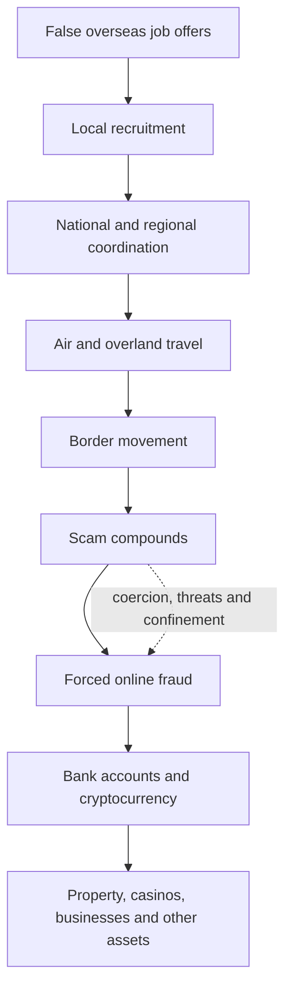
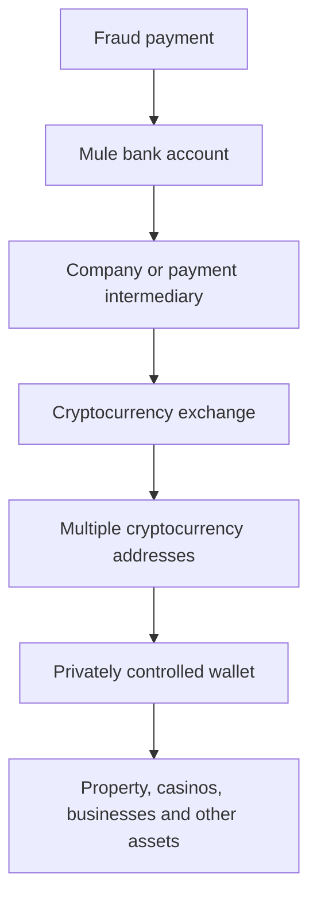
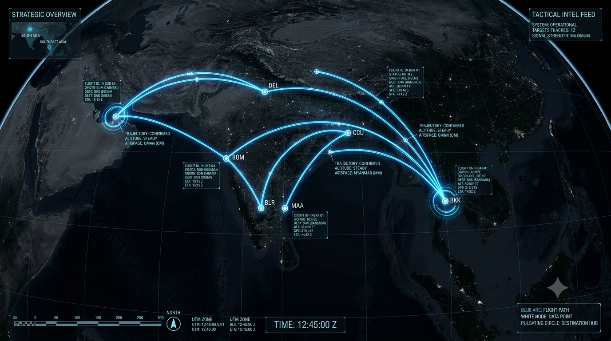
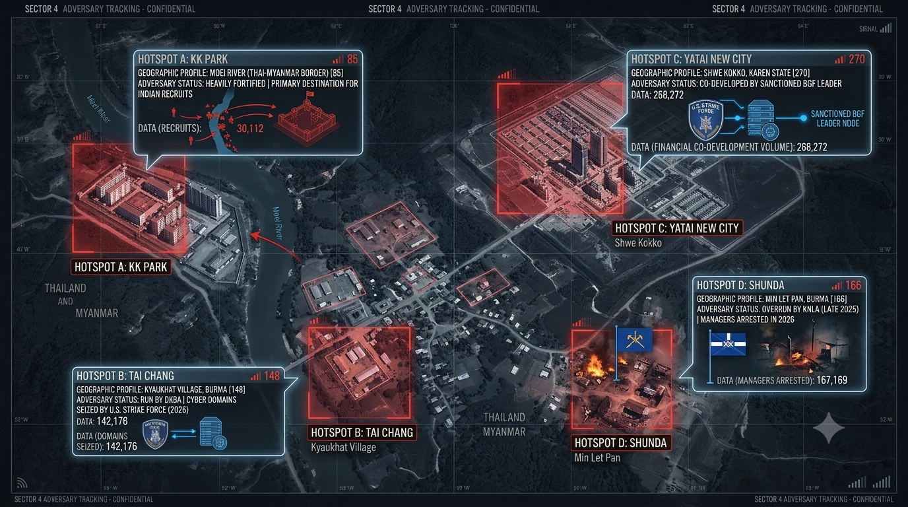
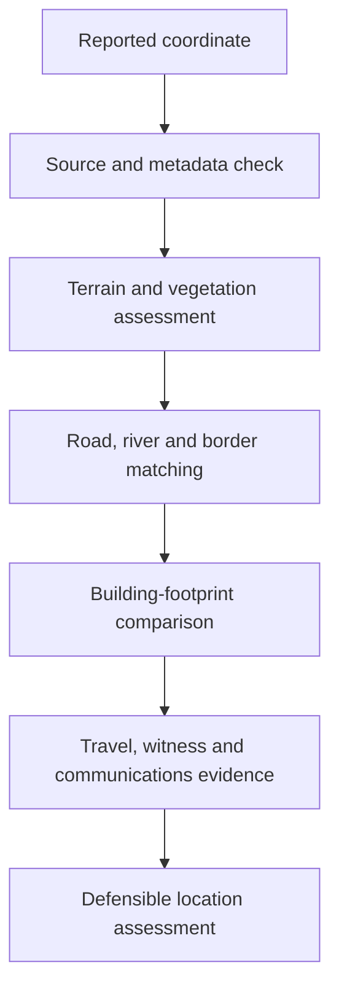
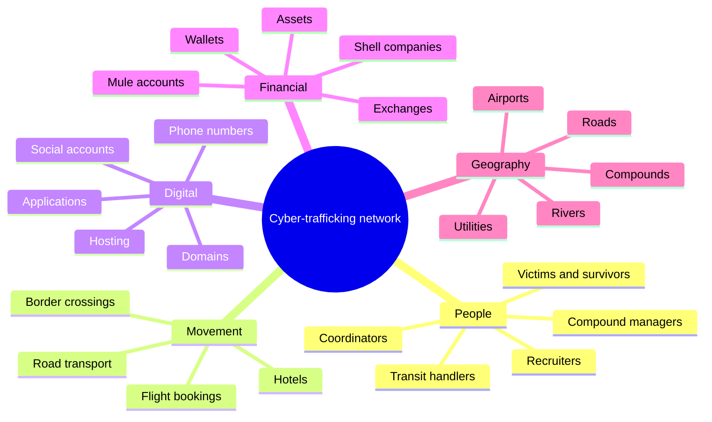

# A GEOINT and Network Analysis of Transnational Cyber-Trafficking

A structured analysis of how deceptive overseas recruitment, human trafficking, cross-border movement, forced online fraud, scam compounds, and criminal financial flows connect across India and Southeast Asia.

> **Status:** Version 5 — Anonymized analytical assessment  
> **Assessment date:** September 2026  
> **Primary focus:** GEOINT and network analysis  
> **Geographic focus:** India, Thailand, Myanmar, Cambodia, and reported transit through the UAE

---

## Important Notice

This repository contains an anonymized, source-derived analytical assessment. It is intended for research, analytical, and educational purposes.

It is **not**:

- a judicial finding;
- a complete trafficking database;
- verified operational targeting information;
- proof of individual or organizational guilt; or
- a substitute for original government, judicial, regulatory, or financial records.

Individual claims, figures, locations, allegations, and relationships should be checked against the underlying primary or official sources before legal, investigative, operational, or public use.

The supplied maps and compound images are **illustrative**. They are not authenticated aerial imagery, verified flight-tracking records, or validated satellite intelligence.

---

## Table of Contents

- [About the Project](#about-the-project)
- [Research Objective](#research-objective)
- [Source of Record](#source-of-record)
- [Core Analytical Model](#core-analytical-model)
- [Geographic Scope](#geographic-scope)
- [Key Findings](#key-findings)
- [Geographic Analysis](#geographic-analysis)
- [GEOINT Method](#geoint-method)
- [Network Analysis](#network-analysis)
- [Financial Analysis](#financial-analysis)
- [Evidence and Confidence](#evidence-and-confidence)
- [Reported Scale](#reported-scale)
- [Emerging Risks](#emerging-risks)
- [Strategic Outlook](#strategic-outlook)
- [Strategic Priorities](#strategic-priorities)
- [Measuring Success](#measuring-success)
- [Information Gaps](#information-gaps)
- [Repository Structure](#repository-structure)
- [Responsible Use](#responsible-use)
- [Citation Convention](#citation-convention)

---

## About the Project

This project examines transnational cyber-trafficking as a connected system rather than as a collection of isolated trafficking, cybercrime, immigration, or financial-fraud incidents.

The analysis brings together five dimensions:

| Dimension | Analytical focus |
|---|---|
| **People** | Victims, survivors, recruiters, coordinators, handlers, facilitators, and compound managers |
| **Places** | Recruitment locations, airports, transit points, border areas, and reported scam compounds |
| **Movement** | Flights, road transport, hotels, river crossings, forest routes, and border movement |
| **Digital activity** | Recruitment channels, social accounts, websites, hosting, communications, and online fraud |
| **Money** | Bank accounts, shell companies, cryptocurrency exchanges, wallets, property, casinos, and other assets |

The value of this approach comes from connecting these dimensions. A recruiter, flight booking, border crossing, domain, bank account, and cryptocurrency wallet may appear unrelated when reviewed separately. Together, they may reveal a larger criminal network.

---

## Research Objective

The project seeks to answer one central question:

> How do recruitment, transportation, forced fraud, physical infrastructure, digital systems, and criminal financial flows connect—and where can those connections be disrupted?

The analysis focuses on identifying:

- recruitment patterns;
- coordinators and facilitators;
- transit corridors;
- geographic chokepoints;
- reported compound locations;
- digital infrastructure;
- financial bottlenecks;
- relationships between separate cases; and
- opportunities for lawful, coordinated intervention.

---

## Source of Record

The project’s primary structured data source is:

**`CYBER_SLAVERY_THREAT_INTEL_REPOSITORY - Google Sheets.pdf`**

This document contains the project’s current:

- source directory;
- ingestion records;
- extracted entities and locations;
- verification status;
- data-quality notes;
- relationship data; and
- strategic analysis.

The GitHub repository serves as the source of record for the project’s current analytical materials and supporting artifacts. It is **not** the original or authoritative source for every underlying allegation.

Where possible, claims should be verified against:

- court documents;
- government statements;
- sanctions records;
- civil-forfeiture complaints;
- company records;
- financial intelligence;
- authenticated imagery;
- blockchain analysis; and
- other primary evidence.

---

## Core Analytical Model



In simplified form:

```text
FAKE JOB OFFERS
        ↓
LOCAL RECRUITMENT
        ↓
COORDINATION
        ↓
AIR + OVERLAND TRAVEL
        ↓
BORDER MOVEMENT
        ↓
SCAM COMPOUNDS
        ↓
FORCED ONLINE FRAUD
        ↓
BANK ACCOUNTS + CRYPTOCURRENCY
        ↓
PROPERTY + CASINOS + OTHER ASSETS
```

The purpose is to understand how the stages connect and where disruption may be possible.

---

## Geographic Scope

The analysis focuses on the following regional pattern:

```text
INDIA → THAILAND → MYANMAR / CAMBODIA
             ↑
       REPORTED UAE TRANSIT
```

### India

Reported recruitment locations include:

- Gujarat
- Haryana
- Maharashtra
- Rajasthan
- Uttar Pradesh
- Tamil Nadu
- Other Indian states identified in individual cases

### Thailand

Important reported transit and border locations include:

- Bangkok
- Suvarnabhumi Airport
- Mae Sot
- Moei River
- Thailand–Myanmar border
- Thai–Cambodian border

### Myanmar

Reported compound locations include:

- Myawaddy
- KK Park
- Tai Chang / Casino Kosai
- Yatai New City / Shwe Kokko
- Shunda / Min Let Pan

### Cambodia

Reported locations include:

- Sihanoukville
- Bavet
- Pursat Province
- Krong Poi Pet

### United Arab Emirates

Dubai appears in the source material as a reported transit and preliminary-training location in some cases. The available material does not establish how frequently this route is used.

---

## Key Findings

### 1. Recruitment and trafficking are connected

The reviewed cases describe deceptive overseas job offers being used to recruit people into a wider trafficking pipeline.

Reported job categories include:

- IT support;
- data entry;
- digital marketing;
- customer service;
- computer operations; and
- call-center work.

Reported recruitment channels include:

- Instagram;
- Facebook;
- Telegram;
- local contacts;
- employment intermediaries; and
- referrals from former workers.

Local recruitment appears decentralized, but higher-level coordinators may connect several agents to common travel, payment, or overseas networks.

Reported commissions vary by case:

- **Local recruiter:** approximately US$1,000–US$2,000 per person
- **Higher-level coordinator:** approximately US$2,000–US$4,500 per person

These figures should be treated as reported case-specific ranges—not as a universal trafficking price.

---

### 2. Travel may begin normally and become coercive later

People may initially travel through commercial airports using valid passports and ordinary travel documents.

The journey may later involve:

- road transportation;
- transfer to unknown handlers;
- forest routes;
- river crossings;
- crossing a border on foot;
- confiscation of travel documents; and
- movement between controlled locations.

This makes early detection difficult. A person may appear to be an ordinary traveler until several risk indicators emerge.

No single indicator—such as age, occupation, destination, or tourist-visa status—should be treated as proof of trafficking.

---

### 3. Scam compounds combine forced labor and online fraud

The reviewed material describes reported conditions including:

- passport confiscation;
- restricted movement;
- guarded entrances;
- 15–18 hour working days;
- fraud quotas;
- threats;
- debt manipulation;
- physical and psychological abuse; and
- transfer or sale between operators.

Workers may be forced to conduct:

- investment fraud;
- cryptocurrency fraud;
- romance or “pig-butchering” scams;
- bank impersonation;
- police impersonation;
- so-called digital-arrest scams;
- fraudulent trading-platform operations; and
- bulk calling or technology-assisted social engineering.

The compounds should therefore be examined as both trafficking sites and cybercrime infrastructure.

---

### 4. Financial links can reveal the wider network

Reported proceeds may move through the following sequence:



Financial analysis may connect:

- local recruiters;
- national coordinators;
- mule-account controllers;
- shell companies;
- cryptocurrency exchanges;
- private wallets; and
- beneficial owners of physical assets.

Physical locations and websites can change quickly. Financial relationships may be harder to replace completely.

---

## Geographic Analysis

### Thailand–Myanmar Corridor

A significant reported corridor follows this pattern:

```text
INDIAN ORIGIN CITY
        ↓
DELHI / MUMBAI
        ↓
BANGKOK
        ↓
MAE SOT
        ↓
MOEI RIVER / FOREST ROUTES
        ↓
MYAWADDY AREA
```

The reviewed material does not establish that this is the only or universally dominant route.



*Figure 1 — Supplied route visualization showing reported travel connections. Illustrative only; not verified flight-tracking or operational route evidence.*

---

### KK Park — Myawaddy

The source material describes KK Park as a heavily fortified compound cluster near the Moei River and a major reported destination for trafficked workers.

Its reported border location may provide:

- access to Thailand;
- proximity to informal river crossings;
- road connections to Mae Sot;
- physical isolation; and
- protection from local armed networks.

The current status, boundaries, and activity of individual buildings require independent verification using recent imagery and corroborating evidence.


*Figure 2 — Supplied visualization of a fortified scam-compound environment. It is not independently authenticated aerial imagery of KK Park.*

---

### Tai Chang / Casino Kosai

The source material associates the reported site with:

- a local armed group;
- a commercial entity;
- cryptocurrency-investment fraud infrastructure;
- sanctions; and
- domain-seizure actions.

Official sanctions and domain actions can provide relatively strong evidence of enforcement activity. Precise physical attribution still requires verification of coordinates, imagery provenance, and site boundaries.

---

### Yatai New City — Shwe Kokko

The analysis describes Yatai New City as a purpose-built development associated with:

- sanctioned actors;
- armed personnel;
- holding companies; and
- cross-border utility dependence.

Reported electricity restrictions demonstrate that utilities may create leverage. Any utility intervention must also consider its effect on workers, residents, and surrounding communities.

---

### Shunda — Min Let Pan

The source reports that the Shunda compound was overrun in November 2025. Managers reportedly moved through other jurisdictions and were later arrested.

This case demonstrates an important network effect:

```text
COMPOUND DISRUPTION
        ↓
MANAGERS AND WORKERS DISPERSE
        ↓
NEW LOCATIONS OR DIGITAL INFRASTRUCTURE
        ↓
OPERATIONS MAY REAPPEAR
```

Closing a physical site may displace the network rather than eliminate it.

---

### Cambodia

The analysis identifies reported activity around:

- Sihanoukville;
- Bavet;
- Pursat Province; and
- Krong Poi Pet.

These locations are discussed in connection with:

- casinos;
- hotels;
- company structures;
- banking or financial infrastructure;
- guarded accommodation; and
- border access.



*Figure 3 — Supplied hotspot visualization showing locations discussed in the analysis. Illustrative only; not validated satellite intelligence or operational targeting information.*

---

### Dubai–Cambodia Route

The source describes another reported route:

```text
NORTHERN INDIA
        ↓
DUBAI
        ↓
REPORTED PRELIMINARY TRAINING
        ↓
BANGKOK
        ↓
OVERLAND MOVEMENT
        ↓
THAI–CAMBODIAN BORDER
        ↓
KRONG POI PET
```

The available material does not establish how frequently this route is used compared with other corridors.

---

## GEOINT Method

A reported coordinate is treated as an investigative lead—not as a final location determination.

### Potential sources of error

Location information may be affected by:

- poor-quality receivers;
- weak satellite geometry;
- jungle and mountainous terrain;
- concrete structures;
- signal reflection;
- GPS interference or spoofing;
- altered metadata; and
- old or incorrectly labeled imagery.

### Verification process



A stronger location assessment requires several independent sources to agree.

Useful corroboration includes:

- authenticated and dated imagery;
- road geometry;
- river alignment;
- visible building footprints;
- seasonal water levels;
- travel records;
- witness descriptions;
- communications data; and
- financial evidence connected to the site.

### Questions for imagery validation

Before using an image operationally, analysts should ask:

1. Who produced the image?
2. When was it captured?
3. Is the location independently confirmed?
4. Has the image been edited or generated?
5. Do roads, rivers, and buildings match external imagery?
6. Is the facility still active?
7. What level of confidence can be assigned?

---

## Network Analysis

The project links five analytical dimensions:

| Dimension | Examples |
|---|---|
| **People** | Victims, survivors, recruiters, coordinators, handlers, compound managers |
| **Movement** | Flights, tickets, vehicles, hotels, border crossings |
| **Digital** | Phone numbers, social accounts, websites, hosting, applications |
| **Financial** | Bank accounts, companies, exchanges, wallets, assets |
| **Geographic** | Compounds, roads, rivers, utilities, imagery |

A shared network model could connect these dimensions as follows:



The analytical value comes from connecting relationships instead of studying each incident separately.

---

## Financial Analysis

### Reported mechanisms

| Mechanism | Description | Analytical value |
|---|---|---|
| **Recruitment commissions** | Agents receive payment for each person delivered | May connect local recruiters to higher-level coordinators |
| **Mule accounts** | Personal or company accounts receive and transfer fraud proceeds | May link separate victim complaints |
| **Shell companies** | Companies provide payment or business cover | May reveal beneficial owners and controllers |
| **Cryptocurrency exchanges** | Funds are converted into virtual assets | Creates a regulated intervention point |
| **Spraying and funneling** | Funds are divided across addresses and later recombined | Wallet clustering may reveal common control |
| **Private wallets** | Assets are held outside custodial services | Seized devices or keys may expose larger pools |
| **Asset integration** | Funds enter property, casinos, businesses, mining, or luxury goods | May identify beneficiaries of the wider network |

The source cites a U.S. restraint action involving **127,271 Bitcoin**, valued at approximately **US$15 billion** at the time referenced.

A restraint is not the same as:

- final forfeiture;
- criminal conviction;
- recovery; or
- return of funds to victims.

---

## Evidence and Confidence

The analysis assigns different weight to different evidence types.

### Higher-reliability evidence

- Unsealed indictments
- Civil-forfeiture complaints
- Sanctions records
- Official asset restraints
- Seized devices and servers
- Company records
- Blockchain analysis
- Court documents

### Medium-reliability evidence

- Survivor accounts
- Police complaints and FIRs
- Arrest announcements
- Preliminary investigations
- Media reporting
- Official statements

### Lower-reliability evidence when used alone

- A single reported coordinate
- Unverified social-media claims
- Images without provenance
- Anonymous allegations without corroboration
- Stylized maps or hotspot graphics

### Confidence scale

| Level | Meaning |
|---|---|
| **High** | Supported by several independent and reliable sources |
| **Medium** | Credible and plausible but incomplete or only partly corroborated |
| **Low** | Based on limited or unverified information requiring further investigation |

Arrests, charges, and sanctions should be described precisely. An arrest or charge establishes an allegation—not guilt.

---

## Reported Scale

| Indicator | Reported figure |
|---|---:|
| Indian nationals traveling to parts of Southeast Asia, January 2022–May 2024 | **70,000+** |
| Indian nationals reportedly not returning during the relevant period | **20,000+** |
| Bitcoin involved in a cited U.S. restraint action | **127,271 BTC** |
| Approximate cited value | **US$15 billion** |
| Indian nationals reportedly present at a Krong Poi Pet site | **600+** |
| Reported local recruitment commission | **US$1,000–US$2,000** |
| Reported higher-level commission | **US$2,000–US$4,500** |

These figures come from different cases, periods, and evidence categories. They should not be combined into a single estimate.

The figure of 20,000 reported non-returnees should not automatically be treated as 20,000 confirmed trafficking victims.

---

## Emerging Risks

### Post-repatriation tradecraft-transfer risk

The source identifies a reported case involving people rescued from a Myanmar scam compound who were later accused of using knowledge gained during confinement in a domestic fraud operation.

This indicates a possible risk involving:

- re-recruitment;
- continued coercion;
- transfer of scam techniques;
- economic vulnerability; or
- voluntary criminal activity in individual cases.

It does **not** establish that rescued workers generally become offenders.

Survivors should not be treated as a suspect population.

A responsible response should include:

- trauma-informed care;
- safe accommodation;
- legal assistance;
- employment support;
- protection from re-recruitment;
- voluntary digital-safety education; and
- investigation only where specific evidence supports it.

---

## Strategic Outlook

### 1. Smaller operations

Large compounds may be replaced by smaller and more mobile sites, including:

- rented offices;
- hotels;
- farmhouses;
- residential properties; and
- temporary cross-border facilities.

### 2. Faster replacement of websites

A seized website can be replaced while its administrators, hosting relationships, payment systems, and communication channels remain active.

Investigators should examine:

- successor domains;
- common hosting;
- TLS certificates;
- analytics identifiers;
- administrator accounts;
- payment integrations; and
- reused wallet addresses.

### 3. More private recruitment

Recruitment may shift toward:

- closed groups;
- encrypted messaging;
- invitation-only channels;
- personal referrals;
- one-to-one contact; and
- temporary accounts.

### 4. Geographic movement

Pressure in one location may push activity into another jurisdiction with weak oversight, corruption, conflict, or casino-heavy development.

### 5. Possible domestic replication

Parts of the scam-compound model may be reproduced inside India. More evidence is required to determine whether such operations are directed by overseas networks or copied independently.

---

## Strategic Priorities

### 1. Disrupt deceptive recruitment

- Verify overseas employers and recruitment companies.
- Identify repeated recruiter accounts and phone numbers.
- Trace recruiter commissions.
- Preserve recruitment messages and payment records.
- Publish multilingual warnings for job seekers.
- Create rapid reporting channels for families.

### 2. Strengthen travel and border intervention

- Improve cross-border coordination.
- Link missing-person information with travel records where lawful.
- Examine recurring ticketing agents, hotels, vehicles, and handlers.
- Establish rapid referral procedures for possible trafficking cases.
- Use evidence-based indicators rather than demographic profiling.

### 3. Disrupt scam infrastructure

- Identify fraudulent investment and trading platforms.
- Preserve evidence before takedown.
- Track replacement websites and applications.
- Examine connected hosting and administrator infrastructure.
- Coordinate with platforms, registrars, hosting providers, and payment services.

### 4. Follow the money

- Identify accounts appearing in multiple complaints.
- Trace recruiter and facilitator payments.
- Examine rapid transfers into cryptocurrency.
- Connect companies with beneficial owners.
- Identify related cryptocurrency addresses.
- Trace proceeds into property and other assets.
- Seek restraint only through appropriate legal processes.

### 5. Protect survivors

- Provide medical and psychological care.
- Offer safe housing and legal assistance.
- Support employment and financial reintegration.
- Protect survivors from retaliation and re-recruitment.
- Avoid blanket suspicion, compulsory surveillance, or automatic criminalization.
- Apply investigative monitoring only where lawful, necessary, and supported by specific evidence.

---

## Measuring Success

Success should not be measured only through arrests, raids, or website removals.

| Objective | Example measure |
|---|---|
| **Prevent trafficking** | Reduction in verified recruitment-to-compound cases |
| **Accelerate intervention** | Time from family report to cross-border referral |
| **Identify leadership** | Number of coordinators and controllers identified |
| **Disrupt criminal finance** | Value lawfully frozen, forfeited, recovered, or returned |
| **Reduce recovery after takedown** | Time required to replace seized infrastructure |
| **Improve prosecutions** | Cases supported by corroborated financial, digital, and geographic evidence |
| **Protect survivors** | Access to housing, care, legal assistance, and employment |
| **Prevent re-exploitation** | Reduction in re-recruitment or repeated coercion |
| **Improve coordination** | Number of linked multi-state and international investigations |

---

## Information Gaps

Important questions remain open:

1. How many reported non-returnees were confirmed trafficking victims?
2. Which recruitment networks connect to the same overseas operators?
3. Which routes are used most often?
4. How quickly are seized websites replaced?
5. Which bank accounts, exchanges, and wallet clusters appear repeatedly?
6. Which reported compounds remain active?
7. Which locations depend on external electricity, telecommunications, water, or fuel?
8. Are domestic operations directed by foreign groups or independently copied?
9. How many repatriated survivors receive sustained support?
10. What is the provenance of the supplied visuals?
11. Which allegations resulted in convictions?
12. Which asset restraints resulted in completed forfeiture or victim recovery?

These gaps should be addressed before making precise claims about scale, route dominance, current site activity, or individual responsibility.

---

## Final Assessment

The reviewed material supports the assessment that transnational cyber-trafficking networks can operate through connected human, geographic, digital, and financial systems.

Their resilience comes from their ability to replace individual components:

```text
RECRUITERS CAN BE REPLACED
        ↓
ROUTES CAN CHANGE
        ↓
WORKERS CAN BE MOVED
        ↓
WEBSITES CAN BE RECREATED
        ↓
COMPOUNDS CAN RELOCATE
        ↓
CRYPTOCURRENCY CAN BE TRANSFERRED
        ↓
PROCEEDS CAN MOVE INTO ASSETS
```

A lasting response must therefore connect:

> **People + Geography + Digital Infrastructure + Finance + International Cooperation**

The central objective is to disrupt the criminal network while protecting the people who have been exploited by it.

---

## Repository Structure

```text
.
├── README.md
├── A_GEOINT_and_Network_Analysis_of_Transnational_Cyber-Trafficking.pdf
├── CYBER_SLAVERY_THREAT_INTEL_REPOSITORY - Google Sheets.pdf
├── Hotspot.png
├── KK_Park.png
└── Routes.png
```

### Repository

[github.com/Imtiaz-laskar/geoint-analysis-transnational-cyber-slavery-human-trafficking](https://github.com/Imtiaz-laskar/geoint-analysis-transnational-cyber-slavery-human-trafficking)

The repository is the source of record for the project’s current analysis, structured data document, report, and supporting visuals.

The underlying material should still be checked against original government, judicial, regulatory, financial, or other primary records before formal use.

---

## Responsible Use

Particular care is required when handling information involving:

- survivors;
- alleged offenders;
- precise locations;
- travel patterns;
- financial information;
- communications data; and
- active investigations.

Recommended safeguards include:

- data minimization;
- anonymization;
- role-based access;
- audit logs;
- retention limits;
- legal review;
- survivor confidentiality; and
- procedures for correcting inaccurate information.

---

## Citation Convention

Citation markers such as `[31]`, `[62,63]`, or `[231–238]` refer to the numbering used in the underlying source material.

This repository does not invent a bibliography where the supplied material does not provide one.

A future version should map each citation number to:

- source title;
- publisher, court, or government agency;
- publication date;
- access date; and
- stable URL or document identifier.

---

## Project Status

| Field | Value |
|---|---|
| **Version** | 5 |
| **Status** | Anonymized analytical assessment |
| **Assessment date** | September 2026 |
| **Primary focus** | GEOINT and network analysis |
| **Geographic focus** | India, Thailand, Myanmar, Cambodia, and reported UAE transit |
| **Source-of-record dataset** | `CYBER_SLAVERY_THREAT_INTEL_REPOSITORY - Google Sheets.pdf` |

---

*Prepared from the supplied anonymized analytical material — 7 September 2026.*
