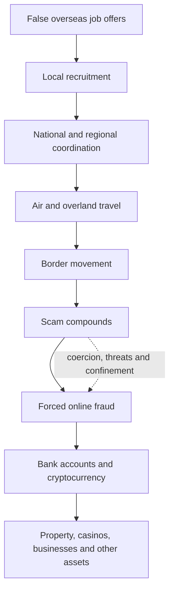
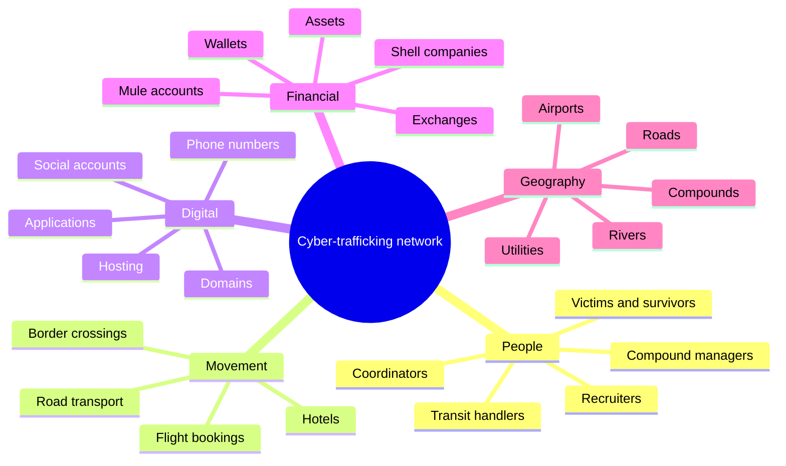

<div align="center">

<br/>

<h1>A GEOINT and Network Analysis of Transnational Cyber-Trafficking</h1>

<p>Structured intelligence assessment — India & South East Asia</p>

<br/>

[](#)
[](#)
[](#)
[](#)

<br/>

> A structured analysis of how deceptive overseas recruitment, human trafficking, cross-border movement, forced online fraud, scam compounds, and criminal financial flows connect across India and Southeast Asia.

<br/>

---

</div>

## 📄 Primary Documents

| Document | Description |
|:---|:---|
| 📑 [**Full Analytical Report**](https://github.com/Imtiaz-laskar/geoint-analysis-transnational-cyber-slavery-human-trafficking/blob/main/A_GEOINT_and_Network_Analysis_of_Transnational_Cyber-Trafficking.pdf) | Complete GEOINT and network analysis — methodology, findings, geographic assessment, financial flows, and strategic outlook |
| 📊 [**Intelligence Source & Data Workbook**](https://github.com/Imtiaz-laskar/geoint-analysis-transnational-cyber-slavery-human-trafficking/blob/main/CYBER_SLAVERY_THREAT_INTEL_REPOSITORY%20-%20Google%20Sheets.pdf) | Structured source directory — ingested entities, locations, verification status, relationship data, and data-quality notes |

> These are the project's source-of-record documents. All claims, figures, and relationships should be verified against original government, judicial, regulatory, or financial records before formal use.

---

## ⚠️ Important Notice

This repository contains an **anonymized, source-derived analytical assessment** intended for research, analytical, and educational purposes.

It is **not:**
- a judicial finding
- a complete trafficking database
- verified operational targeting information
- proof of individual or organizational guilt
- a substitute for original government, judicial, regulatory, or financial records

Individual claims, figures, locations, allegations, and relationships should be checked against underlying primary or official sources before legal, investigative, operational, or public use.

Supplied maps and compound images are **illustrative** — not authenticated aerial imagery, verified flight-tracking records, or validated satellite intelligence.

---

## 📌 About the Project

This project examines transnational cyber-trafficking as a **connected system** rather than a collection of isolated trafficking, cybercrime, immigration, or financial-fraud incidents.

The analysis brings together five dimensions:

| Dimension | Analytical Focus |
|:---|:---|
| **People** | Victims, survivors, recruiters, coordinators, handlers, facilitators, and compound managers |
| **Places** | Recruitment locations, airports, transit points, border areas, and reported scam compounds |
| **Movement** | Flights, road transport, hotels, river crossings, forest routes, and border movement |
| **Digital Activity** | Recruitment channels, social accounts, websites, hosting, communications, and online fraud |
| **Money** | Bank accounts, shell companies, cryptocurrency exchanges, wallets, property, casinos, and other assets |

> The value comes from connecting these dimensions. A recruiter, flight booking, border crossing, domain, bank account, and cryptocurrency wallet may appear unrelated when reviewed separately. Together, they may reveal a larger criminal network.

---

## 🔄 Core Analytical Model

```
FAKE JOB OFFERS
        ↓
LOCAL RECRUITMENT
        ↓
COORDINATION
        ↓
AIR + OVERLAND TRAVEL
        ↓
BORDER MOVEMENT
        ↓
SCAM COMPOUNDS
        ↓
FORCED ONLINE FRAUD
        ↓
BANK ACCOUNTS + CRYPTOCURRENCY
        ↓
PROPERTY + CASINOS + OTHER ASSETS
```



---

## 🌍 Geographic Scope

```
INDIA → THAILAND → MYANMAR / CAMBODIA
              ↑
        REPORTED UAE TRANSIT
```

| Country | Key Locations |
|:---|:---|
| **India** | Gujarat · Haryana · Maharashtra · Rajasthan · Uttar Pradesh · Tamil Nadu |
| **Thailand** | Bangkok · Suvarnabhumi Airport · Mae Sot · Moei River · Thai–Myanmar & Thai–Cambodian borders |
| **Myanmar** | Myawaddy · KK Park · Tai Chang / Casino Kosai · Yatai New City / Shwe Kokko · Shunda / Min Let Pan |
| **Cambodia** | Sihanoukville · Bavet · Pursat Province · Krong Poi Pet |
| **UAE** | Dubai — reported transit and preliminary-training location in some cases |

---

## 🔑 Key Findings

**1. Recruitment and trafficking are connected**

Deceptive overseas job offers (IT support, data entry, digital marketing, customer service) are used to recruit people into a wider trafficking pipeline via Instagram, Facebook, Telegram, local contacts, and employment intermediaries.

**2. Travel may begin normally and become coercive later**

Initial travel through commercial airports using valid documents may later involve road transport, forest routes, river crossings, document confiscation, and transfer between controlled locations — making early detection difficult.

**3. Scam compounds combine forced labor and online fraud**

Reported conditions include passport confiscation, 15–18 hour working days, fraud quotas, debt manipulation, and physical abuse. Workers are forced to conduct investment fraud, cryptocurrency fraud, romance scams, bank/police impersonation, and digital-arrest scams.

**4. Financial links can reveal the wider network**

```
FRAUD PAYMENT → MULE ACCOUNT → SHELL COMPANY
        ↓
CRYPTOCURRENCY EXCHANGE → MULTIPLE ADDRESSES
        ↓
PRIVATE WALLET → PROPERTY + CASINOS + ASSETS
```

---

## 📸 Geographic Analysis

### Thailand–Myanmar Corridor

```
INDIAN ORIGIN CITY → DELHI / MUMBAI → BANGKOK → MAE SOT → MOEI RIVER → MYAWADDY
```


*Figure 1 — Supplied route visualization. Illustrative only; not verified flight-tracking or operational route evidence.*

---

### KK Park — Myawaddy


*Figure 2 — Supplied visualization of a fortified scam-compound environment. Not independently authenticated aerial imagery.*

---

### Geographic Hotspots


*Figure 3 — Supplied hotspot visualization showing locations discussed in the analysis. Illustrative only.*

---

## 🕸️ Network Analysis



---

## 💰 Financial Analysis

| Mechanism | Description | Analytical Value |
|:---|:---|:---|
| **Recruitment commissions** | Agents paid per person delivered | Connects local recruiters to coordinators |
| **Mule accounts** | Personal/company accounts transfer fraud proceeds | Links separate victim complaints |
| **Shell companies** | Provide payment or business cover | May reveal beneficial owners |
| **Cryptocurrency exchanges** | Funds converted into virtual assets | Creates regulated intervention point |
| **Spraying and funneling** | Funds split across addresses, later recombined | Wallet clustering reveals common control |
| **Private wallets** | Assets held outside custodial services | Seized devices may expose larger pools |
| **Asset integration** | Funds enter property, casinos, luxury goods | Identifies network beneficiaries |

---

## 📊 Reported Scale

| Indicator | Reported Figure |
|:---|---:|
| Indian nationals traveling to parts of Southeast Asia (Jan 2022–May 2024) | **70,000+** |
| Indian nationals reportedly not returning during the relevant period | **20,000+** |
| Bitcoin involved in a cited U.S. restraint action | **127,271 BTC** |
| Approximate cited value | **~US$15 billion** |
| Indian nationals reportedly present at a Krong Poi Pet site | **600+** |
| Reported local recruitment commission | **US$1,000–US$2,000** |
| Reported higher-level commission | **US$2,000–US$4,500** |

> These figures come from different cases, periods, and evidence categories. They should not be combined into a single estimate. The figure of 20,000 reported non-returnees should not automatically be treated as 20,000 confirmed trafficking victims.

---

## 🛡️ Evidence & Confidence

```
HIGHER RELIABILITY          MEDIUM RELIABILITY         LOWER RELIABILITY
────────────────────        ──────────────────         ─────────────────
Unsealed indictments        Survivor accounts          Single coordinates
Civil-forfeiture            Police complaints          Unverified claims
  complaints                Arrest announcements       Images w/o provenance
Sanctions records           Media reporting            Anonymous allegations
Asset restraints            Official statements        Stylized maps
Seized devices
Blockchain analysis
Court documents
```

| Confidence Level | Meaning |
|:---|:---|
| **High** | Supported by several independent and reliable sources |
| **Medium** | Credible but incomplete or only partly corroborated |
| **Low** | Based on limited or unverified information requiring further investigation |

---

## 🚨 Emerging Risks

```
SMALLER OPERATIONS          FASTER WEBSITE REPLACEMENT      PRIVATE RECRUITMENT
Rented offices              Successor domains               Closed groups
Hotels / farmhouses         Common hosting reuse            Encrypted messaging
Residential properties      Reused wallet addresses         Invitation-only channels

GEOGRAPHIC MOVEMENT         POSSIBLE DOMESTIC REPLICATION
Pressure displaces          Parts of the model may be
activity to weaker          reproduced inside India —
jurisdictions               requires further evidence
```

---

## 🎯 Strategic Priorities

**① Disrupt deceptive recruitment** — verify overseas employers, trace recruiter commissions, publish multilingual warnings

**② Strengthen travel & border intervention** — improve cross-border coordination, use evidence-based indicators not demographic profiling

**③ Disrupt scam infrastructure** — identify fraudulent platforms, preserve evidence before takedown, track replacement websites

**④ Follow the money** — connect mule accounts to complaints, trace cryptocurrency flows, identify beneficial owners

**⑤ Protect survivors** — trauma-informed care, safe housing, legal assistance, protection from re-recruitment, no blanket suspicion

---

## ❓ Information Gaps

Key questions that remain open:

```
1.  How many reported non-returnees were confirmed trafficking victims?
2.  Which recruitment networks connect to the same overseas operators?
3.  Which routes are used most often?
4.  How quickly are seized websites replaced?
5.  Which bank accounts, exchanges, and wallets appear repeatedly?
6.  Which reported compounds remain active?
7.  Which locations depend on external electricity, water, or fuel?
8.  Are domestic operations directed by foreign groups or copied independently?
9.  How many repatriated survivors receive sustained support?
10. Which allegations resulted in convictions or completed asset forfeiture?
```

---

## 📁 Repository Structure

```
geoint-analysis-transnational-cyber-slavery-human-trafficking/
│
├── 📄  README.md
├── 📑  A_GEOINT_and_Network_Analysis_of_Transnational_Cyber-Trafficking.pdf
├── 📊  CYBER_SLAVERY_THREAT_INTEL_REPOSITORY - Google Sheets.pdf
├── 🖼️  Routes.png
├── 🖼️  KK_Park.png
└── 🖼️  Hotspot.png
```

---

## ⚖️ Responsible Use

Particular care is required when handling information involving survivors, alleged offenders, precise locations, travel patterns, financial information, communications data, and active investigations.

Recommended safeguards: data minimization · anonymization · role-based access · audit logs · retention limits · legal review · survivor confidentiality · procedures for correcting inaccurate information.

---

<div align="center">

*Prepared from anonymized analytical material — September 2026.*

<br/>

*Individual claims should be verified against primary sources before legal, investigative, or public use.*

</div>
